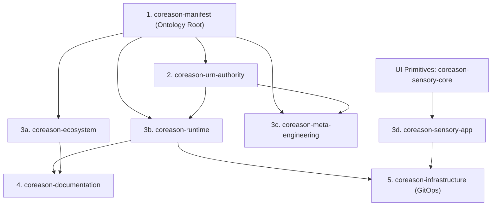

# CoReason Coordinated Release Guide

This document describes the standardized, multi-repository release process for the CoReason suite of packages. It applies to all developers and AI agents working within this workspace.

---

## 1. Release Architecture & Dependency DAG

Because of Python package dependencies and lockfile requirements, releases must propagate down the directed acyclic graph (DAG) below:



### Topological Cascade Rules:
1. **Upstream First:** A change to `coreason-manifest` must be merged, tagged, and published first.
2. **Propagate Dependency Pins:** Downstream repositories must have their version pins updated (in `pyproject.toml` or `package.json`), their lockfiles compiled, and committed before they can be released.

---

## 2. Versioning & Hook Validations

### Version Schemes:
*   **VCS-Dynamic (Hatch):** All Python packages (`coreason-manifest`, `coreason-urn-authority`, `coreason-runtime`, `coreason-ecosystem`, `coreason-meta-engineering`, `coreason-documentation`, `coreason-infrastructure`, `coreason-isv-admin`) resolve their versions dynamically from Git tags using `hatch-vcs`. They retrieve version at runtime using `importlib.metadata` with fallback `"0.0.0-dev"`.
*   **Static/Git Tag Synchronized (Node/NPM):** NPM packages (`coreason-sensory-app`, `coreason-sensory-core`, and `coreason-sensory-embed`) define static versions in `package.json`. These **must match** the Git tag exactly.

### Git Verification Hooks:
To prevent CI publish failures, standard git hooks run automatically on:
1. **Pre-commit:** Ensures static code versions are in valid SemVer format.
2. **Pre-push:** Rejects tag pushes if the tag `vX.Y.Z` does not match the static version defined in code files (for NPM packages only; Python dynamic packages only check that the tag is valid SemVer).

---

## 3. Coordinated Release Pipeline

The release process integrates local verification with cloud-based continuous delivery:

```
[Developer updates coreason-manifest]
             |
             v
1. [Local Helper CLI] --------> Updates dependency version pins, compiles lockfiles,
                                and bumps static package files topologically.
             |
             v
2. [Release Please (Cloud)] --> Evaluates Conventional Commits, maintains CHANGELOG.md,
                                drafts "Release PRs", and creates Git tags on PR merge.
             |
             v
3. [Publish Workflow (CI)] ---> Builds PyPI/NPM packages and Docker containers.
             |
             v
4. [GitOps Promotion (CD)] ---> Triggers a Repository Dispatch payload to Argo CD configurations
                                in `coreason-infrastructure` to roll out new container tags.
```

---

## 4. Release Orchestration Commands

Use the central workspace release manager to run coordinated tasks:

*   **View global status and check mismatches:**
    ```bash
    python scripts/release_helper.py --status
    ```
*   **Bump package versions locally:**
    ```bash
    python scripts/release_helper.py --bump [major|minor|patch] --repo <repo-name>
    ```
*   **Tag a local repository version (checks version matches first):**
    ```bash
    python scripts/release_helper.py --tag <version> --repo <repo-name>
    ```

---

## 5. Agent Boundary Constraints

AI agents operating in this workspace must strictly adhere to the following safety rules:

1.  **No Direct Registry Publishes:** Do not run commands that upload packages or images directly to registries (e.g. `npm publish`, `cargo publish`, `docker push`, `pypi publish`). All publishes must go through GitHub Actions triggered by tag merges.
2.  **No Direct Workflow Modifications:** Do not modify `.github/workflows/` scripts unless specifically directed and approved.
3.  **Strict Commit Conventions:** Use conventional commit formats (`feat(...)`, `fix(...)`, `chore(...)`) for all code modifications.
