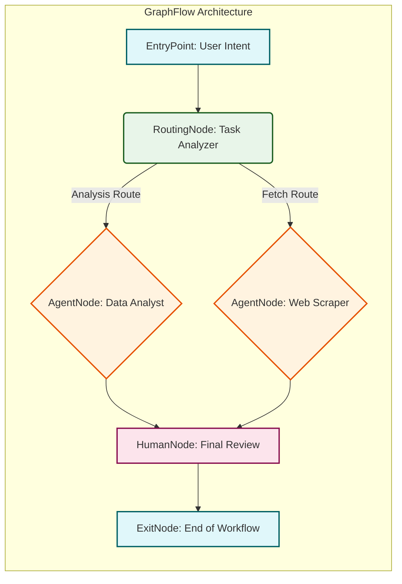
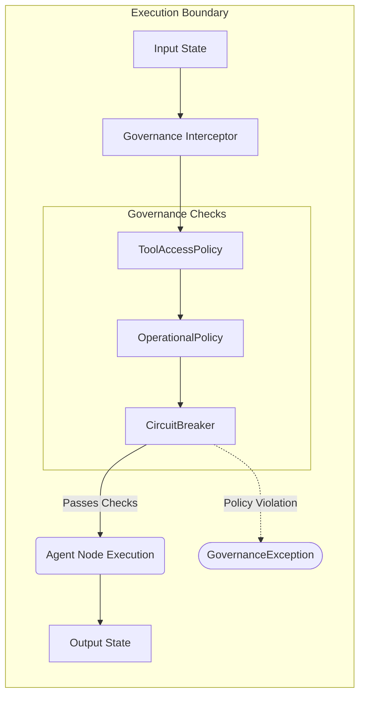
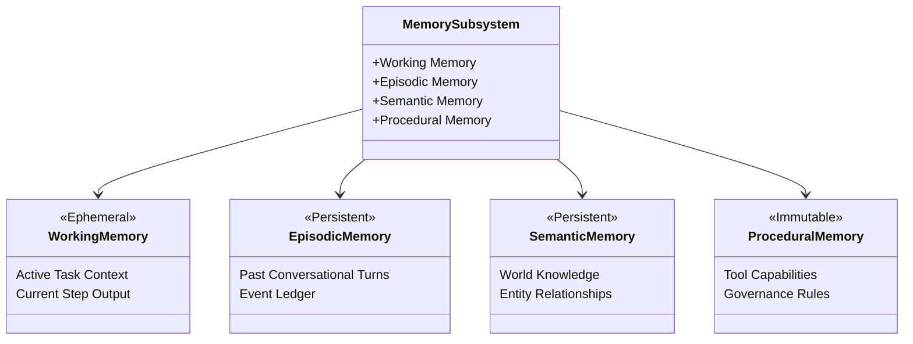

# Architecture Overview

`coreason_manifest` relies on a highly scalable, strictly typed architecture powered by Pydantic V2 models. The system is divided into functional domains that define the structure, behavior, constraints, and state of multi-agent autonomous workflows.

This document breaks down the core architecture into three primary subsystems:

1.  **Flow Topology:** The structural foundation of the Directed Acyclic Graph (DAG) and Linear execution models.
2.  **Governance Layer:** The boundary enforcement mechanisms securing agents and their capabilities.
3.  **Memory Subsystem:** The state management and persistence architecture.

---

## 1. Flow Topology

The flow topology dictates how execution paths are determined within `coreason_manifest`. All flows strictly validate their nodes and edges during initialization, mitigating undefined behavior at runtime.

### Execution Models

There are two primary paradigms:

*   **`LinearFlow`:** A sequence of nodes executing strictly one after another.
*   **`GraphFlow`:** A directed acyclic graph (DAG) enabling complex routing, parallel execution, and conditional logic.

*   **`Nodes`:** Represent independent units of execution, encompassing `AgentNode` (LLM-driven tasks), `HumanNode` (human-in-the-loop intervention), and `RoutingNode` (conditional branching).
*   **`Edges`:** Map outputs of one node to inputs of another, governing state transitions.

---

## 2. Governance Layer

Enterprise agentic workflows require robust guardrails to prevent runaway execution loops, resource exhaustion, or unintended tool access. The Governance layer acts as a wrapper around the Execution layer.

The Governance schema introduces constraints such as:

*   **`ToolAccessPolicy`:** Restricts which nodes can invoke which tools.
*   **`OperationalPolicy`:** Imposes traffic limits, financial budgets, and compute quotas on individual nodes.
*   **`CircuitBreaker`:** Halts execution if an error rate threshold is crossed or anomalous behavior is detected.

---

## 3. Memory Subsystem

Autonomous agents require sophisticated memory handling to maintain context over long-running flows. `coreason_manifest` employs a 4-tier memory architecture to separate ephemeral task context from persistent domain knowledge.

*   **Working Memory:** Ephemeral context tied directly to the current state execution or task context. Flushed upon state transition.
*   **Episodic Memory:** The historical record of execution events and user interactions, allowing the agent to "remember" past sessions.
*   **Semantic Memory:** Knowledge bases, vector-store integrations, and persistent entity relationships.
*   **Procedural Memory:** The immutable rules of execution, detailing how tools operate and what governance constraints are active.