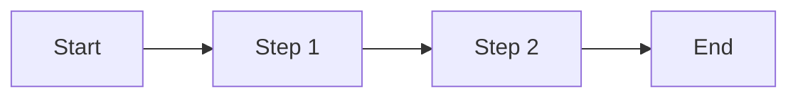
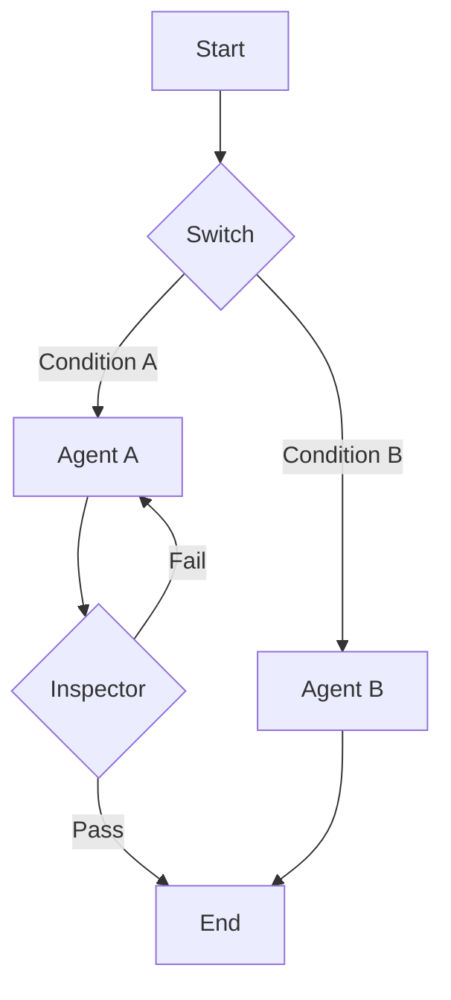

# Topology and State

The `coreason-manifest` architecture defines how cognitive systems are structured (topology) and how they remember information (state).

## 1. Topological Determinism

A core principle of this architecture is **Topological Determinism**. This means that the flow of execution is entirely defined by the *shape* of the graph, not by opaque runtime logic hidden within nodes.

*   If Node A connects to Node B, execution *must* flow from A to B unless a condition prevents it.
*   This determinism allows us to visualize, analyze, and predict the behavior of an agent *before* it runs.

## 2. LinearFlow vs. GraphFlow

The system supports two distinct flow topologies, both implementing the `FlowInterface`.

### LinearFlow

`LinearFlow` is designed for strict, sequential pipelines. It represents a single, unbroken chain of execution where each step's output feeds into the next.

*   **Use Cases**: Data preprocessing, simple Q&A chains, deterministic workflows.
*   **Structure**: A list of `AnyNode` objects executed in order.

### GraphFlow

`GraphFlow` represents a Directed Acyclic Graph (DAG) or even cyclic graphs (with careful loop controls). It enables complex, non-linear orchestration.

*   **Use Cases**: Autonomous agents, multi-step reasoning, conditional logic, loops (e.g., "research -> critique -> refine").
*   **Structure**: A collection of `AnyNode` objects connected by explicit `Edge` definitions.

### FlowInterface

Both `LinearFlow` and `GraphFlow` adhere to the `FlowInterface`, which defines the contract for inputs and outputs. This allows a `LinearFlow` to be nested inside a `GraphFlow` as a subgraph, or swapped out entirely without breaking the outer system.

## 3. The Blackboard

State management is handled via the `Blackboard` pattern.

*   **Abstract Shared Memory**: The Blackboard is a conceptual shared memory space where all nodes in a flow can read and write variables.
*   **Variable Scope**: Variables are scoped to the execution of the flow.
*   **Strict Schemas**: The `Blackboard` schema defines the allowed variables and their types, ensuring that nodes only access valid data.

### How it Works
1.  **Input**: The flow starts with initial variables populated from the `FlowInterface` inputs.
2.  **Execution**: Nodes read variables from the Blackboard, perform their task, and write results back to new or existing variables.
3.  **Output**: The final state of specific variables is mapped to the `FlowInterface` outputs.

This decoupled state model allows nodes to remain stateless and purely functional, simplifying testing and debugging.
