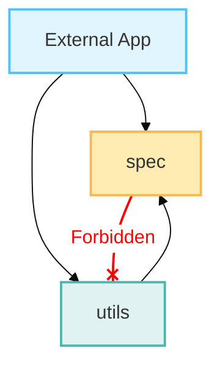

# Package Structure & Architecture

This document outlines the physical structure of the `coreason_manifest` package. The architecture strictly enforces the "Shared Kernel" pattern by separating **Pure Data Specifications** from **Utility Logic**.

## High-Level Layout

The package is divided into two primary namespaces:

*   **`spec/`**: The "Blueprint". Contains *only* Pydantic models, Enums, and Constants. **No runtime logic** (IO, network, complex validation) is allowed here.
*   **`utils/`**: The "Toolbelt". Contains functions to load, dump, validate, and migrate the data defined in `spec/`.

```
src/coreason_manifest/
├── spec/                 # PURE DATA (No side effects)
│   ├── common/           # Version-agnostic domain models (Identity, Observability, etc.)
│   ├── v2/               # V2-specific definitions (ManifestV2, AgentDefinition)
│   ├── cap.py            # CoReason Agent Protocol (CAP) models
│   ├── common_base.py    # Base classes (CoReasonBaseModel)
│   └── governance.py     # Governance configuration models
│
└── utils/                # LOGIC & TOOLS
    ├── v2/               # V2-specific logic
    │   ├── io.py         # Load/Dump YAML with reference resolution
    │   ├── validator.py  # Referential integrity checks
    │   └── governance.py # Policy enforcement logic
    ├── logger.py         # Passive logging utility
    └── migration.py      # Migration utilities (GraphEvent -> CloudEvent)
```

## Detailed Component Guide

### 1. `src/coreason_manifest/spec/`

This directory is the "Source of Truth". If a data structure isn't defined here, it is not part of the standard.

*   **`common_base.py`**: Contains `CoReasonBaseModel`, the parent class for all models. It enforces strict JSON serialization settings (e.g., UUID -> str, datetime -> ISO 8601).
*   **`common/`**: Models shared across the ecosystem, regardless of the Manifest version.
    *   `identity.py`: User and Agent identity structures.
    *   `observability.py`: `CloudEvent`, `AuditLog`, `ReasoningTrace`.
    *   `graph_events.py`: Internal engine events.
*   **`v2/`**: The specific schema for Manifest V2.
    *   `definitions.py`: `AgentDefinition`, `ToolDefinition`.
    *   `contracts.py`: `InterfaceDefinition`, `PolicyDefinition`.
*   **`cap.py`**: The "Wire Protocol" models (`AgentRequest`, `ServiceResponse`) used for runtime communication.

### 2. `src/coreason_manifest/utils/`

This directory contains the code that *operates* on the specs.

*   **`v2/io.py`**: Handles strict YAML loading. It includes the `ReferenceResolver` to safely handle local file references (`$ref`) within the security jail.
*   **`v2/validator.py`**: Performs deep referential integrity checks (e.g., ensuring an AgentStep references a valid Agent ID).
*   **`v2/governance.py`**: The "Police". Checks a Manifest against a `GovernanceConfig` (e.g., "No critical tools allowed without auth").

## Design Rules for Contributors

1.  **Passive Models**: Files in `spec/` must be importable with **zero** side effects. They should only define classes.
2.  **Logic Separation**: If you write a function that *does* something (validates, converts, saves), it belongs in `utils/`.
3.  **Version Isolation**: V2-specific logic stays in `utils/v2/`. If we add V3, it gets a parallel `utils/v3/`.
4.  **Common Core**: If a model is used by multiple versions or the runtime protocol (CAP), place it in `spec/common/`.

## Philosophy: Why "Utils" in a Pure Data Kernel?

While strict "Shared Kernel" architectures often advocate for IDL-only (Interface Definition Language) libraries, `coreason_manifest` deliberately includes a `utils/` directory.

This deviation is justified for three critical reasons:

### 1. Semantic Integrity vs. Structural Integrity
Pydantic models only guarantee **Structural Integrity** (e.g., "Field `X` must be a string"). However, a functional Manifest requires **Semantic Integrity** (e.g., "The string in Field `X` must reference a valid Agent ID defined elsewhere").
By including `validator.py` (Referential Integrity Logic) within the kernel, we prevent "implementation drift" where the CLI, UI, and Engine might implement slightly different validation rules.

### 2. Security "Jail" Logic
The Manifest allows local file references (`$ref`). Security logic to ensure these references do not traverse outside a "jail" (`utils/v2/resolver.py`) is a critical security feature. It is safer to ship the "Secure Loader" with the schema than to rely on every consumer to implement their own path traversal protection correctly.

### 3. Governance Portability
Governance Policies (`GovernanceConfig`) are data, but applying them (`check_compliance`) is logic. By keeping the enforcer in the kernel, we allow "Policy" to be portable. A policy defined in the Web UI can be enforced identically in the CLI because they share the exact same enforcement code.

## Package Map


