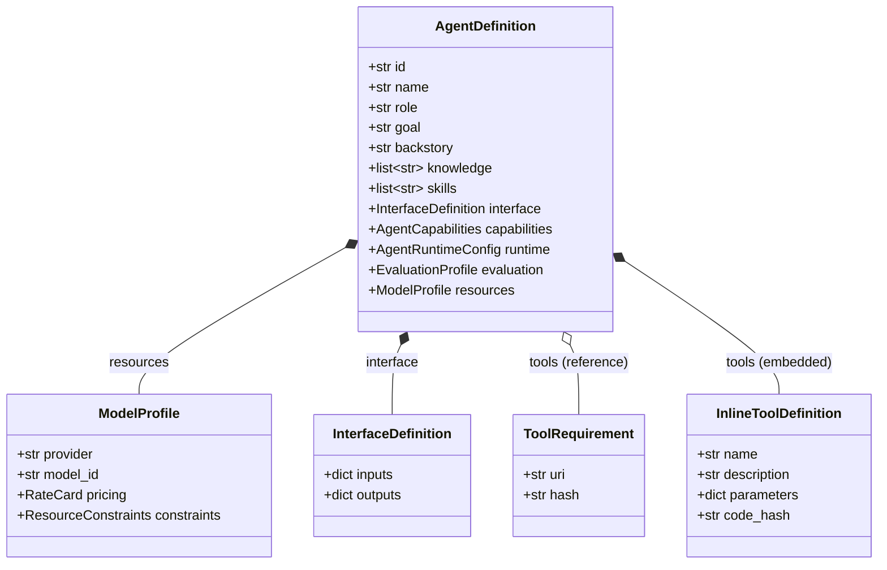

# Agent Definition

## Architecture

This diagram illustrates the composition of an `AgentDefinition`, highlighting its relationships with resources (Model), tools, and knowledge.

```mermaid
classDiagram
    class AgentDefinition {
        +str id
        +str name
        +str role
        +str goal
        +str backstory
        +list~str~ knowledge
        +list~str~ skills
        +InterfaceDefinition interface
        +AgentCapabilities capabilities
        +AgentRuntimeConfig runtime
        +EvaluationProfile evaluation
        +ModelProfile resources
    }
    class ModelProfile {
        +str provider
        +str model_id
        +RateCard pricing
        +ResourceConstraints constraints
    }
    class ToolRequirement {
        +str uri
        +str hash
    }
    class InlineToolDefinition {
        +str name
        +str description
        +dict parameters
        +str code_hash
    }
    class InterfaceDefinition {
        +dict inputs
        +dict outputs
    }

    %% Composition
    AgentDefinition *-- ModelProfile : resources
    AgentDefinition *-- InterfaceDefinition : interface

    %% Aggregation/Composition for tools (Polymorphic list)
    AgentDefinition o-- ToolRequirement : tools (reference)
    AgentDefinition *-- InlineToolDefinition : tools (embedded)

    %% Note: Knowledge is represented as a list of strings (IDs/Paths) within AgentDefinition
```
