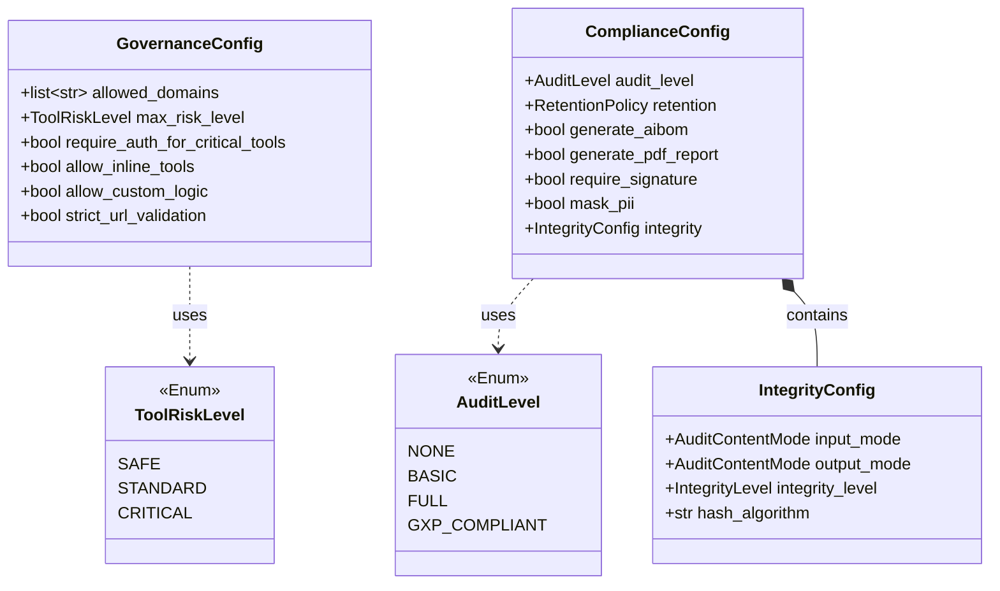

# Governance Model

## Policy and Compliance

This diagram visualizes the `GovernanceConfig` for static validation and `ComplianceConfig` for runtime auditing.

```mermaid
classDiagram
    class GovernanceConfig {
        +list~str~ allowed_domains
        +ToolRiskLevel max_risk_level
        +bool require_auth_for_critical_tools
        +bool allow_inline_tools
        +bool allow_custom_logic
        +bool strict_url_validation
    }
    class ComplianceConfig {
        +AuditLevel audit_level
        +RetentionPolicy retention
        +bool generate_aibom
        +bool generate_pdf_report
        +bool require_signature
        +bool mask_pii
        +IntegrityConfig integrity
    }
    class ToolRiskLevel {
        <<Enum>>
        SAFE
        STANDARD
        CRITICAL
    }
    class AuditLevel {
        <<Enum>>
        NONE
        BASIC
        FULL
        GXP_COMPLIANT
    }
    class IntegrityConfig {
        +AuditContentMode input_mode
        +AuditContentMode output_mode
        +IntegrityLevel integrity_level
        +str hash_algorithm
    }

    %% Relationships (Conceptual Dependencies)
    GovernanceConfig ..> ToolRiskLevel : uses
    ComplianceConfig ..> AuditLevel : uses
    ComplianceConfig *-- IntegrityConfig : contains

    %% Note: GovernanceConfig validates the Manifest, while ComplianceConfig governs runtime auditing.
```
