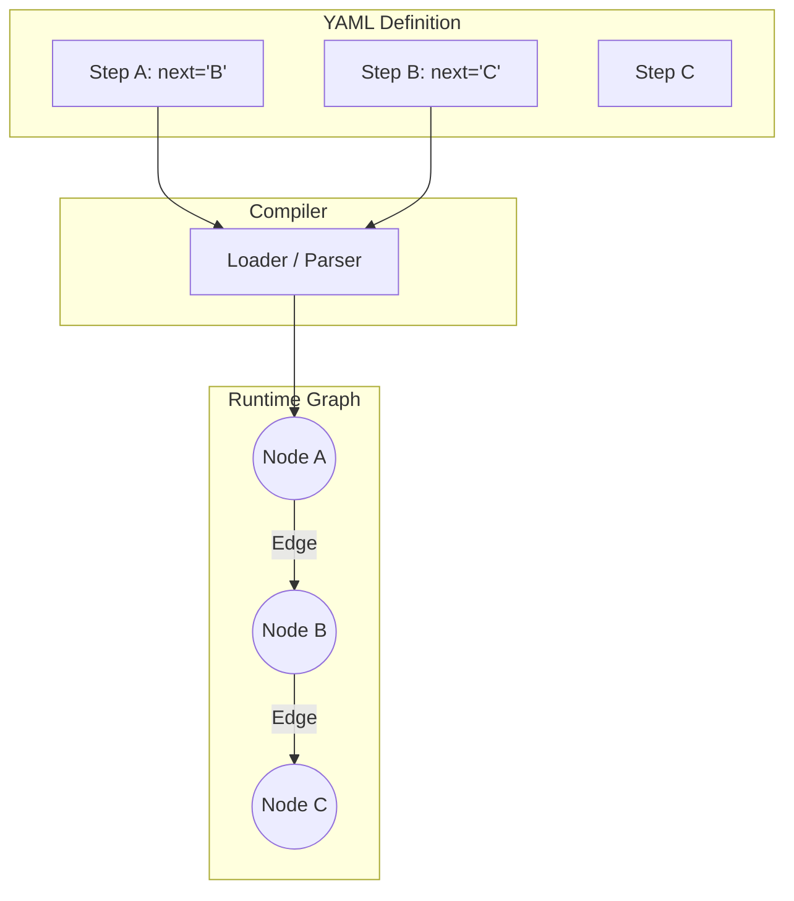

# RFC 001: Coreason Manifest v2 - Canonical YAML

## 1. Executive Summary

### The Problem
The Coreason Manifest v1 was designed as a "Machine-First" specification. It relied on verbose, deeply nested JSON structures (via Pydantic v1/v2) that mirrored the internal runtime state of the engine. While strictly typed and robust, it presented significant challenges:
*   **Authoring Friction:** Writing v1 manifests by hand was error-prone and tedious due to its verbosity.
*   **Cognitive Load:** The "Edge List" topology required developers to mentally graph connections, rather than thinking in linear steps.
*   **Lossy Conversion:** UI tools had to "compile down" to v1, losing visual layout data (`x`, `y` coordinates) in the process, making round-tripping between Code and UI impossible.

### The Solution
We introduce **Coreason Manifest v2**, a "Human-Centric" **Canonical YAML** format. This format serves as the single source of truth for *both* the Runtime Engine and the Visual Builder.

### The Goal
**Bidirectional Interchangeability.** A developer should be able to scaffold a workflow in VS Code (YAML), open it in the Visual Builder to rearrange nodes, and save it back to YAML without losing comments, structure, or visual metadata.

---

## 2. The v2 Architecture ("The Kubernetes Pattern")

The v2 format adopts the proven Kubernetes-style header structure, ensuring familiarity and extensibility.

### Root Object: `ManifestV2`

```yaml
apiVersion: coreason.ai/v2
kind: Recipe
metadata:
  name: "Corporate Research Assistant"
  version: "2.0.0"
  x-design:
    color: "#4A90E2"
    icon: "search"

definitions:
  # Reusable Component Definitions
  researcher:
    type: "agent"
    name: "Senior Researcher"
    model: "gpt-4"

  # External Tool Definitions (RFC 003)
  calculator:
    id: "tool-calc"
    name: "Calculator"
    uri: "https://api.calc.com/v1"
    risk_level: "safe"

workflow:
  start: "step-1"
  steps:
    step-1: ...
```

*   **`apiVersion`**: Defines the schema version (`coreason.ai/v2`), allowing the engine to route parsing logic correctly.
*   **`kind`**: Specifies the asset type (`Recipe`, `Agent`, `Evaluation`).
*   **`metadata`**: Contains descriptive fields (`name`, `version`) and the crucial `x-design` block for UI-level settings.
*   **`definitions`**: A dictionary of reusable components. Instead of redefining an Agent in every step, you define it once here and reference it by ID. This promotes DRY (Don't Repeat Yourself) principles.

---

## 3. "Implicit Flow" Topology

### Concept: Linked List vs. Edge List
Humans think in steps: *"First do A, then do B."*
Machines think in graphs: *"Node A connects to Node B."*

Manifest v1 forced the human to write the Graph. Manifest v2 allows the human to write the Steps, and the *Loader* compiles the Graph.

*   **v1 (Machine Model):** Explicit `nodes` list and `edges` list.
*   **v2 (Human Model):** Steps contain a **`next`** field pointing to the ID of the following step.

### Hybrid Support (The Compiler)
Under the hood, the Coreason Loader reads the `next` field and generates an explicit `Edge` object. This means the Runtime Engine *still* receives a fully validated Directed Acyclic Graph (DAG), maintaining strict execution guarantees.

### Diagram: Translation Logic



---

## 4. Complex Workflow Capabilities

While `next` handles linear flows, v2 fully supports complex control structures like branching, loops, and hybrid execution.

### Loops and Recursion
Because `next` or `switch` cases can point to *any* step ID, creating loops for quality control or iterative refinement is trivial.

#### Example: Quality Check Loop
```yaml
steps:
  generate:
    id: "generate"
    type: "agent"
    agent: "writer"
    next: "evaluate"

  evaluate:
    id: "evaluate"
    type: "agent"
    agent: "critic"
    next: "check_score"

  check_score:
    id: "check_score"
    type: "switch"
    cases:
      "result.score >= 0.9": "publish"  # Pass
      "result.score < 0.9": "generate"  # Loop back!
    default: "generate"

  publish:
    id: "publish"
    type: "logic"
    code: "print('Published!')"
```

### Hybrid Workflows
Manifest v2 treats **Logic** (Python code) and **Agents** (LLMs) as first-class citizens. You can seamlessly weave them together.

```yaml
steps:
  extract_data:
    type: "agent"
    agent: "extractor_agent"
    next: "sanitize"

  sanitize:
    type: "logic"
    code: |
      # Pure Python execution
      data = inputs['data']
      return data.strip().lower()
    next: "summarize"

  summarize:
    type: "agent"
    agent: "summary_agent"
```

---

## 5. Visual Data Separation (`x-design`)

To achieve bidirectional interchangeability with UI builders, we must persist visual layout data without polluting the runtime logic.

### The `x-design` Field
We adopt the `x-` vendor extension pattern (common in OpenAPI). The `x-design` field (mapped to `design_metadata` in Python) holds all UI-specific information.

*   **Fields:**
    *   `x`, `y`: Canvas coordinates (float).
    *   `icon`: Visual icon identifier.
    *   `color`: Node color hex code.
    *   `collapsed`: UI state.
    *   `label`: Optional display override.

### Round-Tripping Philosophy
1.  **Engine:** Ignores `x-design` entirely during execution.
2.  **Visual Builder:** Reads `x-design` to render the graph.
3.  **Serializer:** Preserves `x-design` when saving back to YAML, ensuring that a developer's manual layout adjustments are never lost.

```yaml
step-1:
  type: "agent"
  # Runtime cares about this:
  agent: "researcher"
  next: "step-2"
  # Designer cares about this:
  x-design:
    x: 120.5
    y: 400.0
    color: "#ff0000"
    icon: "robot-search"
```

---

## 6. Composition & Modularity

Manifest v2 supports composition through reference.

### The `$ref` Pattern
Steps can reference components defined in the `definitions` block. This is critical for keeping the `workflow` block clean and readable.

```yaml
definitions:
  my-custom-agent:
    id: "agent-007"
    type: "agent"
    model: "gpt-4"
    system_prompt: "You are a spy."

workflow:
  start: "mission-brief"
  steps:
    mission-brief:
      type: "agent"
      # References the definition above
      agent: "agent-007"
```

### Nested Workflows (Future)
Steps of `type: workflow` (or `recipe`) can reference external Manifest files. This allows for "Sub-Recipes" or hierarchical Standard Operating Procedures (SOPs).

```yaml
    sub-task-step:
      type: "recipe"
      recipe: "./sub-workflows/data-cleaning.yaml"
      next: "analysis"
```

---

## 7. Migration & Compatibility

### Non-Destructive Strategy
The v2 implementation is located in `src/coreason_manifest/v2/`. It does not modify, import, or depend on the existing `src/coreason_manifest/definitions/` (v1) code.
*   **v1** remains the stable runtime format for now.
*   **v2** is introduced as an RFC and experimental interface.

### Implementation Status
**Status: Implemented (Loader Bridge)**

As of `coreason-manifest` v0.13.0 (estimated), the **V2 Loader Bridge** is available. This bridge allows V2 YAML files to be loaded and compiled into V1 `RecipeManifest` objects at runtime.

The implementation differs slightly from the initial RFC proposal in that it explicitly depends on V1 definitions to perform the translation, acting as a true "Bridge" layer.

### Upgrade Path
We will provide a CLI utility (`coreason upgrade`) that:
1.  Parses a v1 `AgentDefinition` or `RecipeManifest`.
2.  Auto-generates the `next` pointers by traversing the edge list.
3.  Assigns default `x-design` coordinates (using a graph layout algorithm).
4.  Outputs valid v2 Canonical YAML.

This ensures that existing assets can be migrated to the new Human-Centric format with zero data loss.
