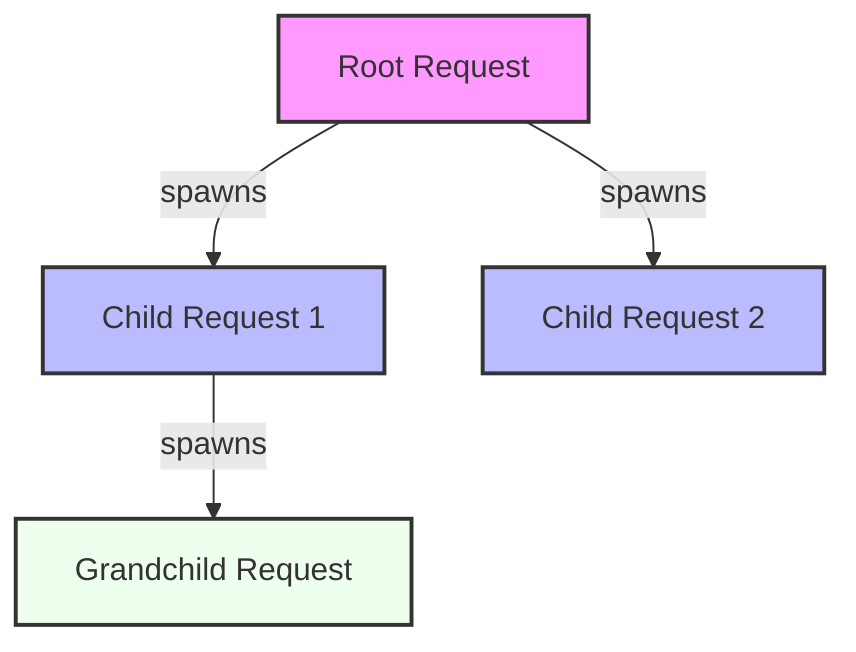

# Transport Layer: Distributed Tracing

The **Transport Layer** defines the fundamental envelope for all communication within the CoReason ecosystem. It ensures that every interaction—whether a user request, an inter-agent call, or a system event—carries the necessary context for **Distributed Tracing**, **Session Management**, and **Audit Logging**.

## Concept: The Request Lineage

In a multi-agent system, a single user request often triggers a cascade of sub-requests. To debug and audit these complex flows, we use a lineage model compatible with OpenTelemetry.

### Lineage Diagram



*   **Root Request**: The original user interaction.
*   **Parent Request**: The immediate caller.
*   **Child Request**: The resulting action.

## The Envelope: `AgentRequest`

The core model is `AgentRequest`, which acts as a strictly typed, immutable envelope.

**Import:**
```python
from coreason_manifest.spec.common.request import AgentRequest
```

### Fields

| Field | Type | Description | Required | Default |
| :--- | :--- | :--- | :--- | :--- |
| `request_id` | `UUID` | Unique ID for *this specific operation*. | Yes | `uuid4()` |
| `session_id` | `UUID` | Groups requests into a coherent user session. | **Yes** | - |
| `root_request_id` | `UUID` | The ID of the original request that started the trace. | Yes | `request_id` (Auto-rooting) |
| `parent_request_id` | `Optional[UUID]` | The ID of the immediate caller (for nested traces). | No | `None` |
| `payload` | `Dict[str, Any]` | The actual business logic arguments (e.g., `{"query": "hello"}`). | Yes | - |

### Usage: Preserving Lineage

To propagate context, **always** use the `create_child()` method. This ensures lineage integrity by setting the parent and root IDs correctly.

```python
from uuid import uuid4
from coreason_manifest.spec.common.request import AgentRequest

# 1. Incoming Request (Root)
root_req = AgentRequest(
    session_id=uuid4(),
    payload={"task": "Plan a trip"}
)

print(f"Trace Started: {root_req.root_request_id}")

# 2. Agent A calls Agent B (Child)
# Automatically inherits session_id and sets parent pointers
child_req = root_req.create_child(
    payload={"subtask": "Book flight"}
)

# 3. Validation
assert child_req.root_request_id == root_req.request_id  # Same trace
assert child_req.parent_request_id == root_req.request_id # Parent link established
assert child_req.session_id == root_req.session_id       # Session preserved
```

## Integrity Rules

1.  **Auto-Rooting**: If `root_request_id` is missing, the system automatically assigns the current `request_id` as the root.
2.  **Broken Trace Prevention**: You cannot provide a `parent_request_id` without a `root_request_id`. The validator will raise a `ValueError`.
3.  **Immutability**: `AgentRequest` instances are frozen. To modify data (e.g., in middleware), use `model_copy`.
