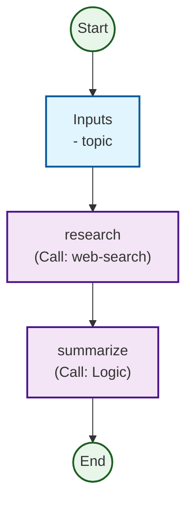

# Visualization Tools

As Agents grow from simple prompt wrappers into complex multi-step graphs (DAGs), understanding the execution flow becomes critical. The `coreason-manifest` package provides a utility to generate **Mermaid.js Flowcharts** directly from your `AgentDefinition` (Manifest).

## Generating a Graph

The `generate_mermaid_graph` function parses the manifest's workflow, inputs, and steps to produce a Mermaid syntax string.

### Usage Example

```python
from coreason_manifest import generate_mermaid_graph, Manifest

# Load your manifest
manifest = Manifest.model_validate({
    "apiVersion": "coreason.ai/v2",
    "kind": "Agent",
    "metadata": {"name": "Research Agent"},
    "interface": {
        "inputs": {
            "topic": {"type": "string"}
        }
    },
    "workflow": {
        "start": "research",
        "steps": {
            "research": {
                "type": "agent",
                "id": "research",
                "agent": "web-search",
                "next": "summarize"
            },
            "summarize": {
                "type": "logic",
                "id": "summarize",
                "code": "summarizer_func",
                "next": None
            }
        }
    }
})

# Generate the Mermaid string
mermaid_code = generate_mermaid_graph(manifest)
print(mermaid_code)
```

### Output

The output is a string compatible with any Mermaid.js renderer (GitHub, Notion, Obsidian, etc.):



## Styling

The graph uses specific classes to distinguish node types:
*   **Green (Rounded)**: Start / End terminals.
*   **Blue**: Inputs.
*   **Purple**: Workflow Steps (Agents, Logic, Switch, Council).

## Handling Complex Flows

The visualizer supports:
*   **Switch Steps**: Branches are labeled with their conditions.
*   **Loops**: Cyclic dependencies are rendered naturally by Mermaid.
*   **Disconnected Nodes**: Steps defined in the workflow but not linked are still rendered, helping identify orphaned logic.
