# Magentic UI & Visualization Protocol

The `coreason-manifest` library includes a visualization engine designed to render not just the static topology of an agent system, but its **runtime state** and **interactive capabilities**.

The engine serves two distinct purposes:
1.  **Static Rendering:** Generates Mermaid.js/JSON graphs for documentation and "Glass Box" transparency.
2.  **Dynamic Experience:** Defines the "Viewport" and "Components" for the runtime UI, dictating how the frontend (e.g., Flutter, Streamlit) adapts to the agent's current cognitive state.

## The Passive Visualization Engine

Adhering to the "Shared Kernel" philosophy, the visualization engine in `coreason_manifest.utils.viz` is strictly **passive**. It converts a `RecipeDefinition` into visual artifacts without running a server or requiring heavy dependencies.

## Magentic Concepts

The V2 engine introduces three key concepts that allow the backend to drive the frontend experience:

### 1. Cognitive Viewports (`ViewportMode`)

Agents often need more than a chat interface. The `initial_viewport` field tells the UI which high-level layout to display.

| Viewport Mode | Description | Use Case |
| :--- | :--- | :--- |
| `STREAM` | Standard chat interface. | Simple Q&A, fast interactions. |
| `ARTIFACT_SPLIT` | Chat on left, Document/Code on right. | Code generation, document drafting. |
| `PLANNER_CONSOLE` | Dedicated task list and Gantt chart view. | Project management, multi-step planning. |
| `CANVAS` | Infinite whiteboard. | Brainstorming, architectural diagrams. |

### 2. Generative Components (`ComponentSpec`)

Agents can request specific "Generative Components" to be rendered within the viewport. Instead of returning markdown text, the agent specifies a `type` (e.g., `DATA_GRID`, `KANBAN_BOARD`).

### 3. Magentic Co-Planning (`is_mutable`)

This is the core of the "Magentic" experience. When `is_mutable=True` is set on a component, it signals that the **User** is expected to edit the agent's draft before execution proceeds.

**Workflow:**
1.  **Agent Drafts:** The agent generates a plan and populates a mutable `KANBAN_BOARD` component.
2.  **User Edits:** The user drags and drops tasks in the UI.
3.  **Agent Executes:** The agent reads the *modified* state from the UI and executes the revised plan.

## Defining Visualization Hints

You define these behaviors using `PresentationHints` on the `RecipeNode`.

```python
from coreason_manifest.spec.common.presentation import (
    PresentationHints,
    ViewportMode,
    ComponentSpec,
    ComponentType
)
from coreason_manifest.spec.v2.recipe import AgentNode

# Example: An Agent that presents an editable plan
node = AgentNode(
    id="planner_agent",
    # ... other agent fields ...
    visualization=PresentationHints(
        initial_viewport=ViewportMode.PLANNER_CONSOLE,
        display_title="Strategic Planner",
        icon="lucide:map",
        components=[
            ComponentSpec(
                id="plan_editor",
                type=ComponentType.KANBAN_BOARD,
                data_source="memory.strategic_plan",
                is_mutable=True,  # User can drag/drop tasks
                title="Proposed Strategy"
            )
        ]
    )
)
```

## Visual Semantics (Mermaid.js)

When generating static documentation using `generate_mermaid_graph`, the engine applies specific visual cues to represent these capabilities.

| Feature | Visual Representation | Meaning |
| :--- | :--- | :--- |
| **Standard Node** | Solid Border | A deterministic, non-interactive step. |
| **Magentic Node** | **Dashed Purple Border** | The node contains mutable components (Drafting/Editing state). |
| **Viewport Label** | `(View: PLANNER)` text | The step triggers a major UI layout shift. |
| **Custom Icon** | Icon prepended to title | Visual aid defined in manifest (e.g., 🧠, 🗺️). |

### Example Output

```mermaid
graph TD
classDef magentic fill:#f3e5f5,stroke:#7b1fa2,stroke-width:2px,stroke-dasharray: 5 5;
planner_node["🧠 Strategic Planner<br/>(View: planner_console)"]:::magentic
```



## Glass Box Observability

The engine also supports "Time Travel" debug views by accepting a `RuntimeStateSnapshot`. This overlays execution status (e.g., "Running", "Failed") onto the graph.

```python
from coreason_manifest.utils.viz import generate_mermaid_graph
from coreason_manifest.spec.common.presentation import RuntimeStateSnapshot, NodeStatus

# Create a snapshot of execution
snapshot = RuntimeStateSnapshot(
    node_states={
        "planner_agent": NodeStatus.COMPLETED,
        "executor": NodeStatus.RUNNING
    }
)

# Generate graph with state overlay
mermaid_code = generate_mermaid_graph(recipe, state=snapshot)
```
